# How to Play Space Trader

Space Trader is a turn-based hex-grid tactics card game. You command a faction base, deploy units, gather resources, and play cards to destroy the enemy base.

---

## The Battlefield

When a match starts, you see the hex grid with your base, your opponent's base, resource nodes scattered across the map, your hand of cards, and your resource pool.

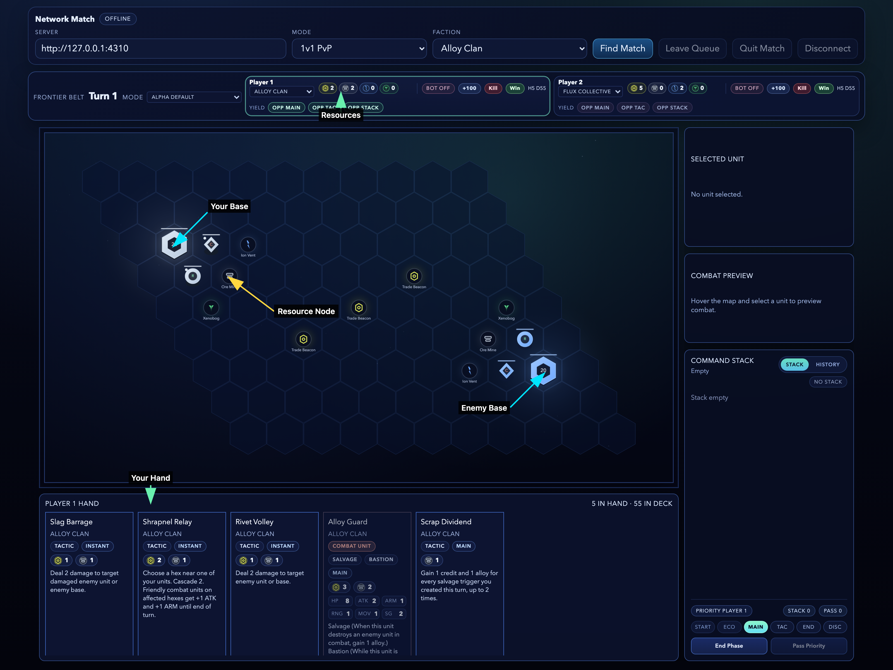

Your goal is simple: **reduce the enemy base to 0 HP.**

Each player starts with a combat unit and a resource harvester already deployed near their base.

---

## Resources

You have two types of resources:

- **Credits** — universal currency, earned passively (+1 per turn) and from Trade Beacon nodes
- **Faction resource** (Alloy, Flux, or Biomass) — harvested from map nodes specific to your faction

Cards cost a combination of both. For example, `C3 A2` means 3 Credits and 2 Alloy.

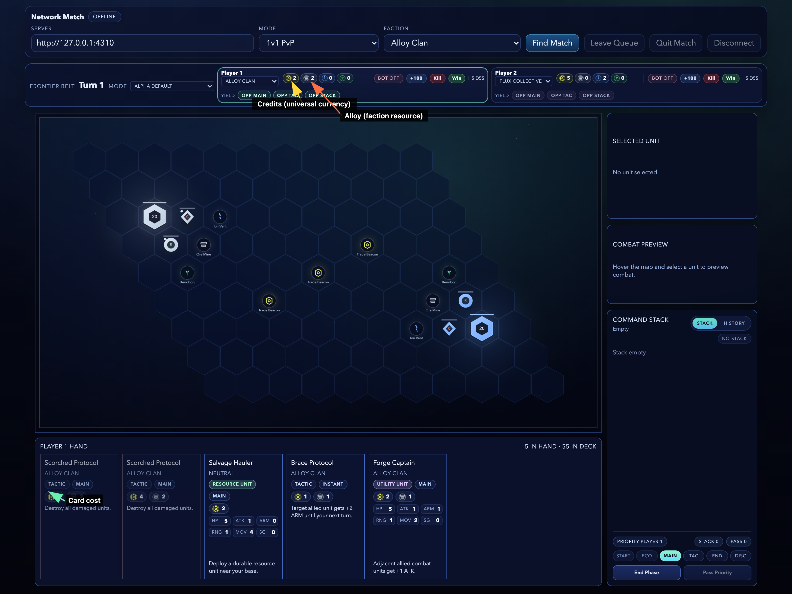

Starting resources depend on seat order:
- Starting player: 2 Credits + 2 primary
- Other players: 5 Credits + 2 primary

---

## Turn Phases

Each turn moves through phases in order. Press **N** to advance.

| Phase | What happens |
|-------|-------------|
| **Start** | Draw 1 card |
| **Economy** | Loaded harvesters deposit cargo, gain +1 Credit |
| **Main** | Deploy units from hand |
| **Tactical** | Move, attack, and harvest |
| **End** | Node control updates |

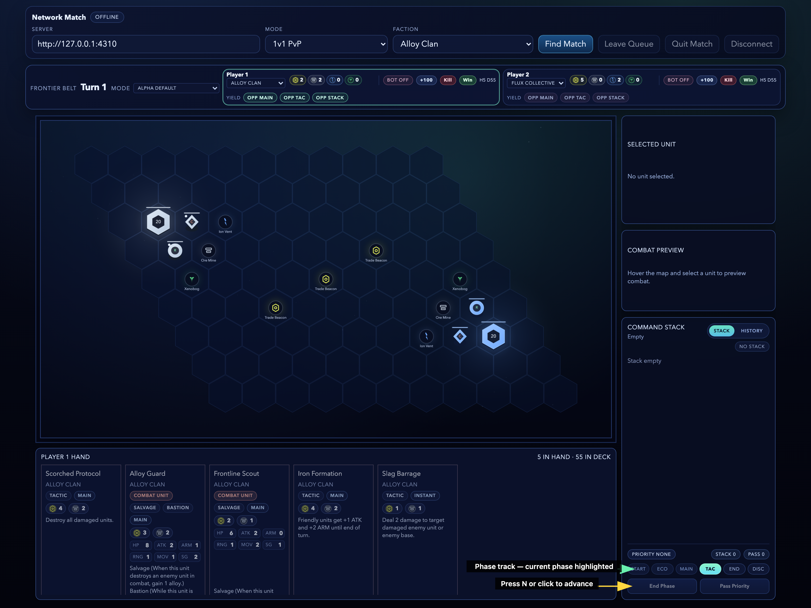

---

## Deploying Units

During the **Main** phase, click a unit card in your hand to deploy it. Units deploy to tiles adjacent to your base.

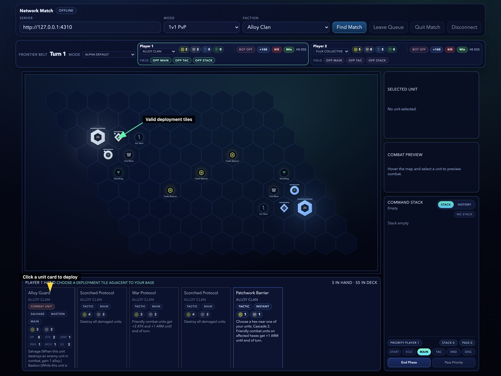

Unit cards cost Credits and faction resources. Make sure you have enough before trying to deploy.

---

## Units on the Battlefield

Deployed units have stats visible in the HUD panel when selected:

- **HP** — health points
- **ATK** — attack damage
- **ARM** — armor (reduces incoming combat damage)
- **MOV** — movement range per turn
- **ACT** — attacks per turn
- **SG** — siege bonus (extra damage against bases)

Newly deployed units have **summoning sickness** and cannot act until your next turn.

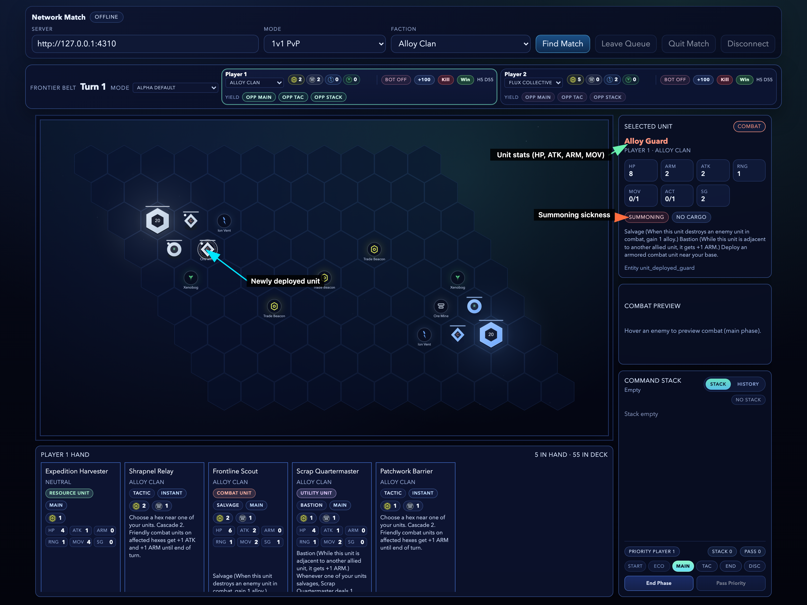

---

## Moving Units

In the **Tactical** phase, click a unit (or press **U**) to select it, then use the **arrow keys** to move it. The highlighted hexes show where it can reach.

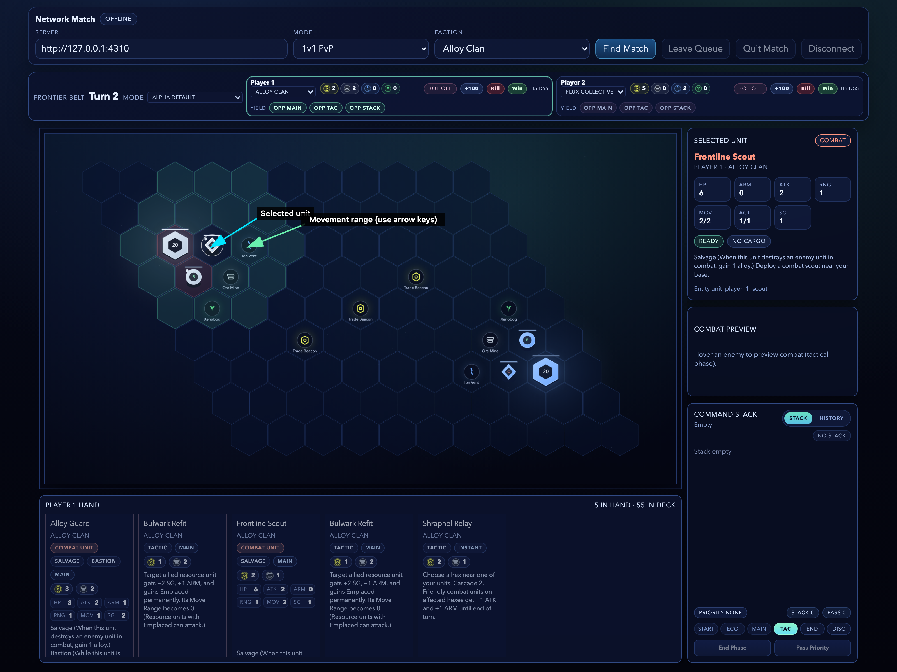

Units can move and attack in the same turn, spending from their move and attack budgets independently.

---

## Attacking

With a unit selected, press **A** to enter attack mode. Valid targets highlight — click one to attack.

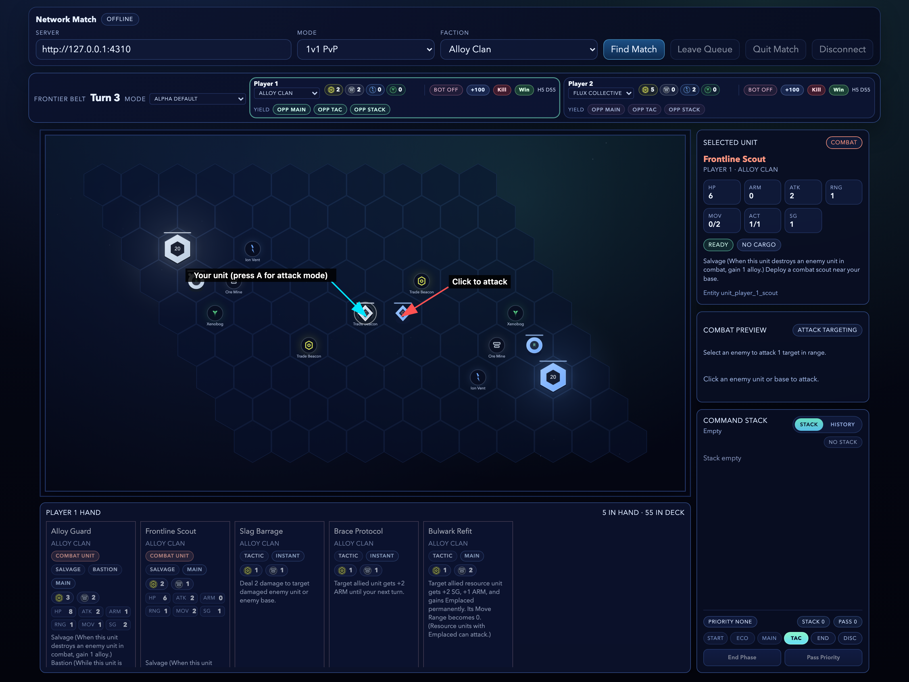

Combat resolves immediately:
- Attacker deals its ATK minus the target's ARM (minimum 1 damage)
- Siege bonus applies when attacking bases
- Units at greater distance from a friendly base suffer a supply penalty

---

## Resource Harvesting

The economy works like StarCraft-style harvesting:

1. **Capture** a resource node by having a unit on it at end of turn
2. **Harvest** — select your resource unit on the node, press **H** to load cargo
3. **Return** — move the loaded harvester to a tile adjacent to your base
4. **Deposit** — happens automatically during the Economy phase (+2 resources)

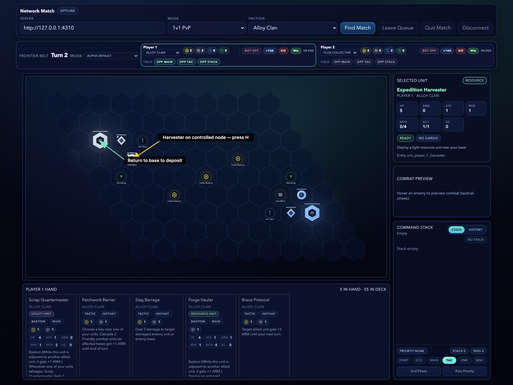

If a loaded harvester is destroyed, the cargo is lost.

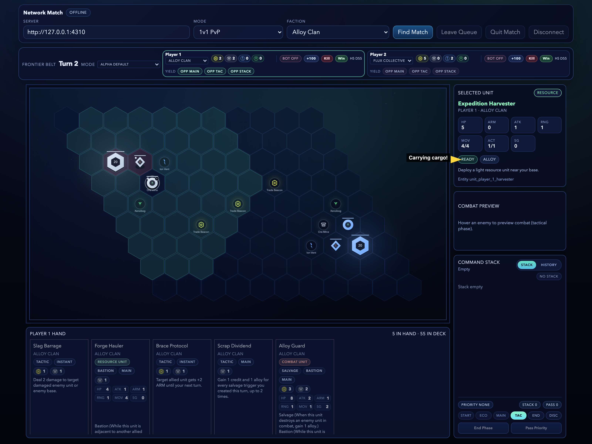

---

## Playing Tactic Cards

Tactic cards (instants) can be played whenever you have **priority** — during any phase, even on your opponent's turn. Click the card in your hand to play it.

Tactics go onto the **stack** and your opponent gets a chance to respond before they resolve.

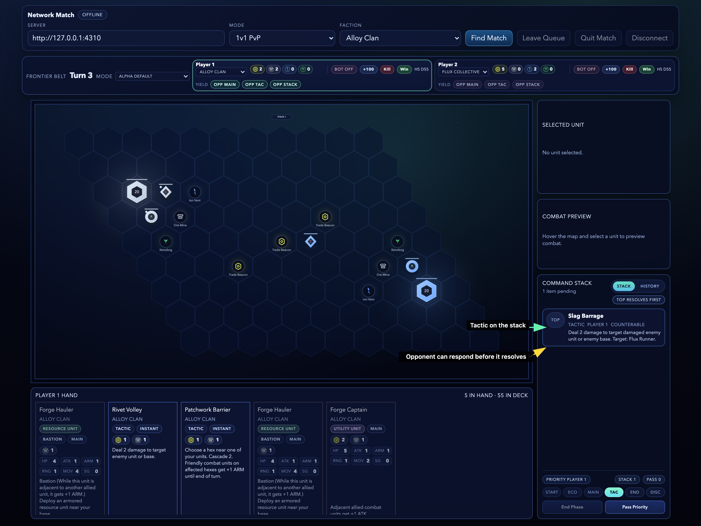

---

## The Stack and Priority

The stack is the core interaction system. It works like MTG's stack:

- Cards resolve **last in, first out** (LIFO) — the top item resolves first
- After you play a card, your opponent gets priority to respond
- If all players pass in sequence, the top item resolves
- Press **P** to pass priority

In this example, Player 1 played Slag Barrage, but Player 2 responded with Counter Pulse. The counter resolves first, negating the barrage.

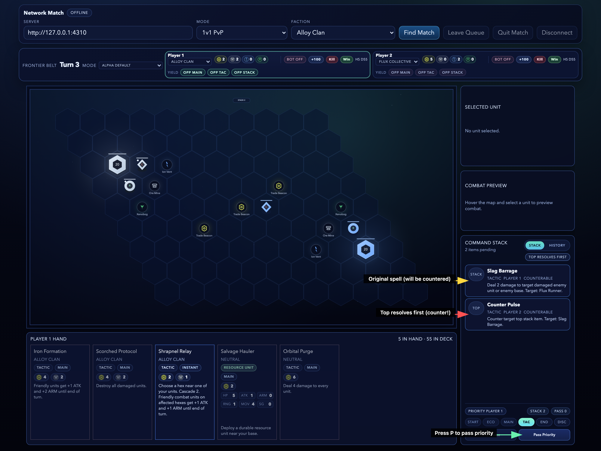

Unit cards also go onto the stack when cast, so opponents can counter them before they deploy.

---

## Winning the Game

Move your combat units to the enemy base and attack it. Reduce it from 20 HP to 0 to win.

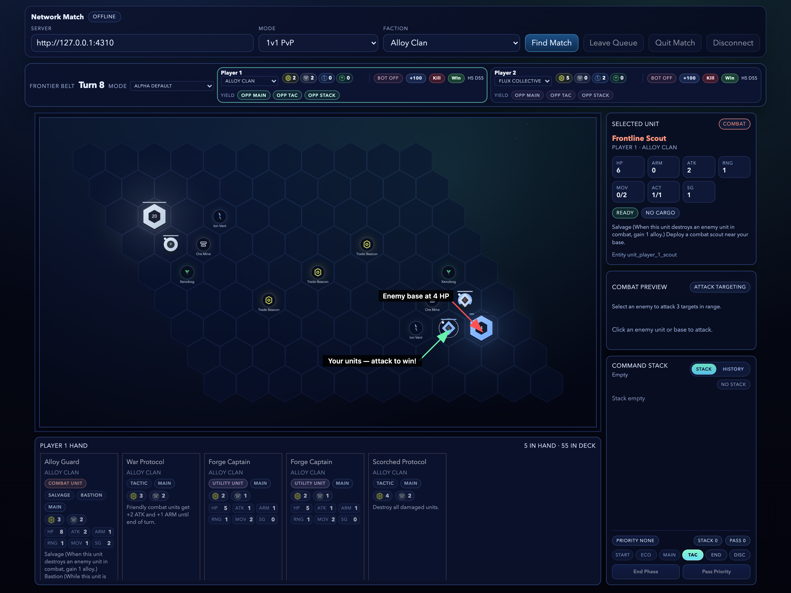

Siege units deal bonus damage to bases and bypass the supply penalty when attacking them, making them essential for closing out games.

---

## Quick Reference

| Key | Action |
|-----|--------|
| **N** | Advance phase |
| **U** | Select first unit |
| **Arrow keys** | Move selected unit |
| **A** | Enter attack mode |
| **H** | Harvest with resource unit |
| **P** | Pass priority |
| **Esc** | Cancel action |
| **Click card** | Play from hand |

### The Core Loop

1. **Draw** a card (automatic at start of turn)
2. **Deploy** units in Main phase
3. **Move, attack, and harvest** in Tactical phase
4. **Build your economy** by harvesting resources
5. **Play tactics** to interact on the stack
6. **Destroy the enemy base** to win

### If Something Goes Wrong

Check the **Last Reject** message in the HUD. Common reasons:
- Wrong phase for that action
- Not enough resources
- You don't have priority
- No legal target available
- No open deployment tile near your base
